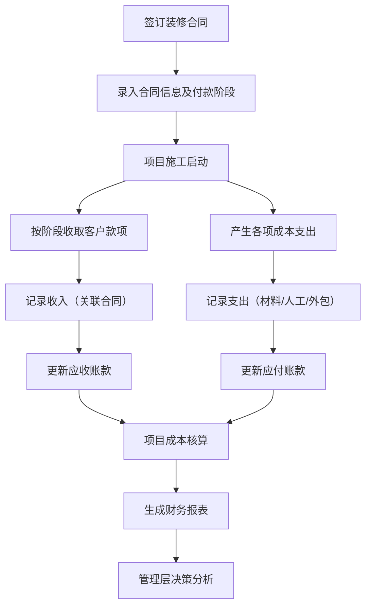
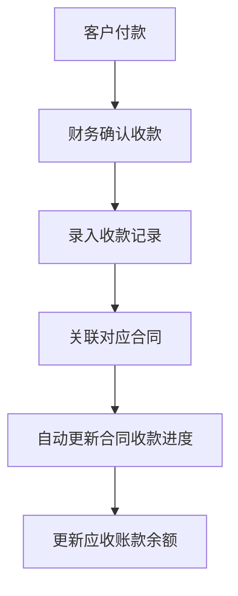
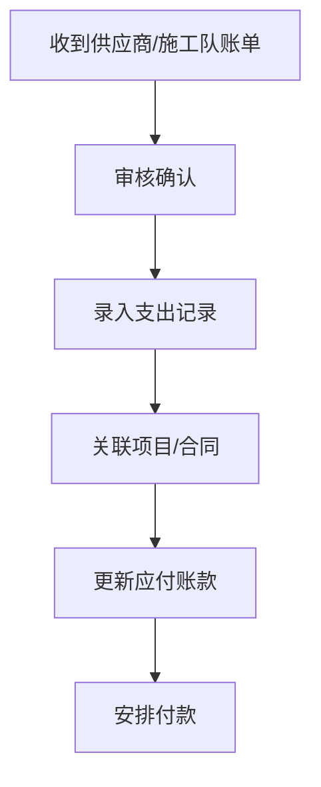
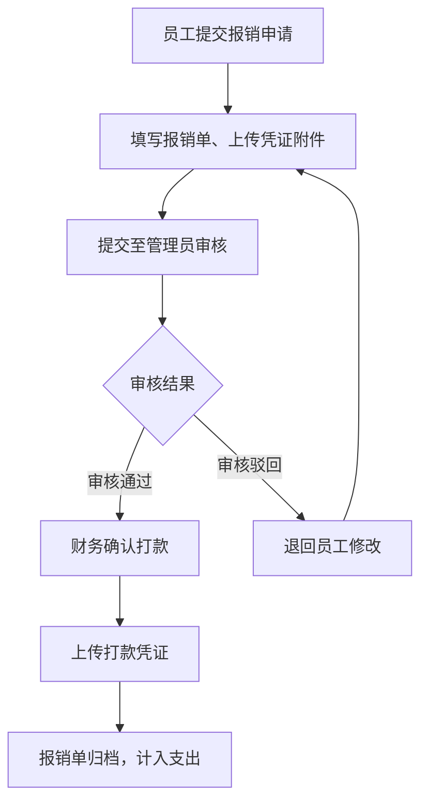

## 1. 产品概述

品诺筑家整装财务管理系统是专为家装公司设计的ERP财务管理模块，帮助公司高效管理项目合同、收入支出、应收应付账款、成本核算及财务报表，实现装修项目全生命周期的财务管控。

* **目标用户**：财务主管、会计、项目经理、公司管理层

* **核心价值**：以装修项目为主线的财务闭环管理，实时掌握每个项目的收入、成本、利润，辅助经营决策

## 2. 核心功能

### 2.1 用户角色

| 角色       | 权限说明                |
| -------- | ------------------- |
| 管理员/财务主管 | 全部功能权限，可查看所有数据、导出报表、审批报销 |
| 会计       | 日常记账、收支管理、应收应付管理、财务打款    |
| 项目经理     | 仅查看所负责项目的财务数据、提交项目相关报销     |
| 普通员工     | 提交个人报销申请、查看自己报销进度     |

### 2.2 功能模块

1. **财务仪表盘**：公司整体财务概览，收入/支出/利润汇总，图表展示
2. **合同管理**：装修合同录入、合同金额、付款阶段管理
3. **收入管理**：客户收款记录，按合同/项目维度追踪收款进度
4. **支出管理**：材料费、人工费、外包费等各项成本支出记录
5. **应收账款**：客户欠款跟踪、账龄分析、催款提醒
6. **应付账款**：供应商/施工队应付款项管理
7. **项目成本核算**：按装修项目维度核算收入、成本、毛利
8. **资金流水**：所有收支明细流水账，支持筛选导出
9. **财务报表**：利润表、现金流量表、项目利润排行等
10. **费用报销**：员工提交报销申请、上传凭证附件、管理员审核、财务打款，全流程追踪

### 2.3 页面详情

| 页面名称   | 模块名称    | 功能描述                         |
| ------ | ------- | ---------------------------- |
| 财务仪表盘  | 概览卡片    | 本月收入、本月支出、净利润、应收账款总额四个核心指标卡片 |
| 财务仪表盘  | 收入支出趋势图 | 近12个月收入/支出/利润折线图             |
| 财务仪表盘  | 项目利润排行  | Top 5 盈利项目和 Top 5 亏损项目柱状图    |
| 财务仪表盘  | 应收应付概览  | 应收账款账龄分布饼图、应付账款到期提醒          |
| 合同管理   | 合同列表    | 表格展示所有装修合同，支持搜索、筛选、排序        |
| 合同管理   | 合同录入/编辑 | 表单录入合同编号、客户信息、房屋地址、合同金额、付款阶段 |
| 合同管理   | 合同详情    | 展示合同基本信息、收款记录、关联支出、利润概览      |
| 收入管理   | 收款记录列表  | 按时间/合同/客户筛选收款记录              |
| 收入管理   | 新增收款    | 选择关联合同、填写收款金额、收款方式、收款日期      |
| 支出管理   | 支出记录列表  | 按类别（材料/人工/外包/其他）筛选支出         |
| 支出管理   | 新增支出    | 选择支出类别、关联项目、金额、日期、备注         |
| 应收账款   | 应收列表    | 按客户/项目显示应收余额、已收金额、账龄         |
| 应付账款   | 应付列表    | 按供应商/类别显示应付余额、已付金额           |
| 项目成本核算 | 项目利润表   | 每个项目的合同金额、已收款、总成本、毛利、毛利率     |
| 项目成本核算 | 项目详情    | 单个项目的收支明细、成本构成               |
| 资金流水   | 流水明细    | 所有收支记录的时间序列表，支持日期范围筛选和导出     |
| 财务报表   | 利润表     | 按月/季度/年汇总的收入、成本、费用、利润        |
| 财务报表   | 现金流量表   | 经营活动现金流入流出汇总                 |
| 费用报销   | 报销列表    | 按状态（待审核/已审核/已打款/已驳回）Tab切换，展示所有报销单 |
| 费用报销   | 提交报销    | 填写报销类型（差旅/采购/交通/其他）、金额、日期、事由、上传附件图片 |
| 费用报销   | 报销详情    | 展示申请信息、审核流转记录、附件预览、操作按钮（审核通过/驳回/确认打款） |
| 费用报销   | 我的报销    | 当前登录员工查看自己提交的全部报销单及状态 |

## 3. 核心流程

### 3.1 主流程：装修项目财务管理闭环

### 3.2 收款流程

### 3.3 付款流程

### 3.4 报销流程

## 4. 用户界面设计

### 4.1 设计风格

* **主色调**：黑金配色 —— 深邃黑（#0d0d0d / #1a1a1a / #1c1c1c）+ 奢华香槟金（#d4a843 / #c9a96e / #b8943a），体现高端整装的奢华品质感

* **辅助色**：深灰背景（#f5f0e8 暖灰米色）、卡片深色（#1e1e1e）、侧边栏纯黑（#0a0a0a）

* **强调色**：金色用于重点数据/标题（#d4a843）、绿色表示收入（#10b981）、红色表示支出（#ef4444）

* **字体**：标题使用思源黑体/Noto Sans SC，正文使用系统默认中文字体

* **布局**：左侧深色导航栏 + 右侧内容区，经典ERP布局

* **卡片风格**：轻微阴影、圆角，简洁专业

* **图表**：使用 ECharts 实现可视化图表

* **图标**：使用 Lucide React 图标库

### 4.2 页面设计概览

| 页面名称   | 模块名称 | UI元素                   |
| ------ | ---- | ---------------------- |
| 财务仪表盘  | 概览卡片 | 4个指标卡片横向排列，带图标和环比变化百分比 |
| 财务仪表盘  | 趋势图  | 双Y轴折线图，展示收入/支出/利润趋势    |
| 财务仪表盘  | 项目排行 | 横向柱状图，绿色正利润/红色负利润      |
| 合同管理   | 合同列表 | 表格+顶部搜索筛选栏+新增按钮        |
| 收入管理   | 收款列表 | 表格+金额汇总卡片+筛选条件         |
| 支出管理   | 支出列表 | 表格+分类Tab切换+金额汇总        |
| 项目成本核算 | 利润表  | 表格+毛利率条件格式（颜色标识）       |
| 财务报表   | 报表展示 | 表格式报表+时间筛选+导出按钮        |
| 费用报销   | 报销列表 | 状态标签（待审核橙色/已通过绿色/已驳回红色）+审核操作按钮 |
| 费用报销   | 报销表单 | 表单+附件上传区域（支持图片拖拽上传）      |

### 4.3 响应式设计

* 桌面端优先设计（1920px基准），适配1366px及以上

* 平板端（768px-1024px）：导航栏折叠、卡片堆叠

* 移动端适配基础查询功能，复杂报表建议桌面端操作

## 5. 非功能需求

* 数据本地存储（使用 IndexedDB / localStorage 模拟后端），保证离线可用

* 所有金额精确到分（两位小数）

* 表格支持排序、筛选、分页

* 支持数据导出为CSV/Excel格式

* 关键操作有确认提示，防止误操作

 

 

 

 

