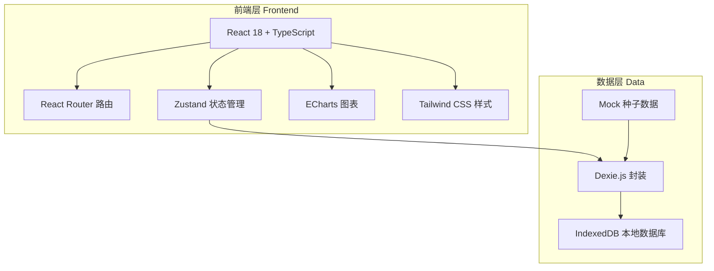
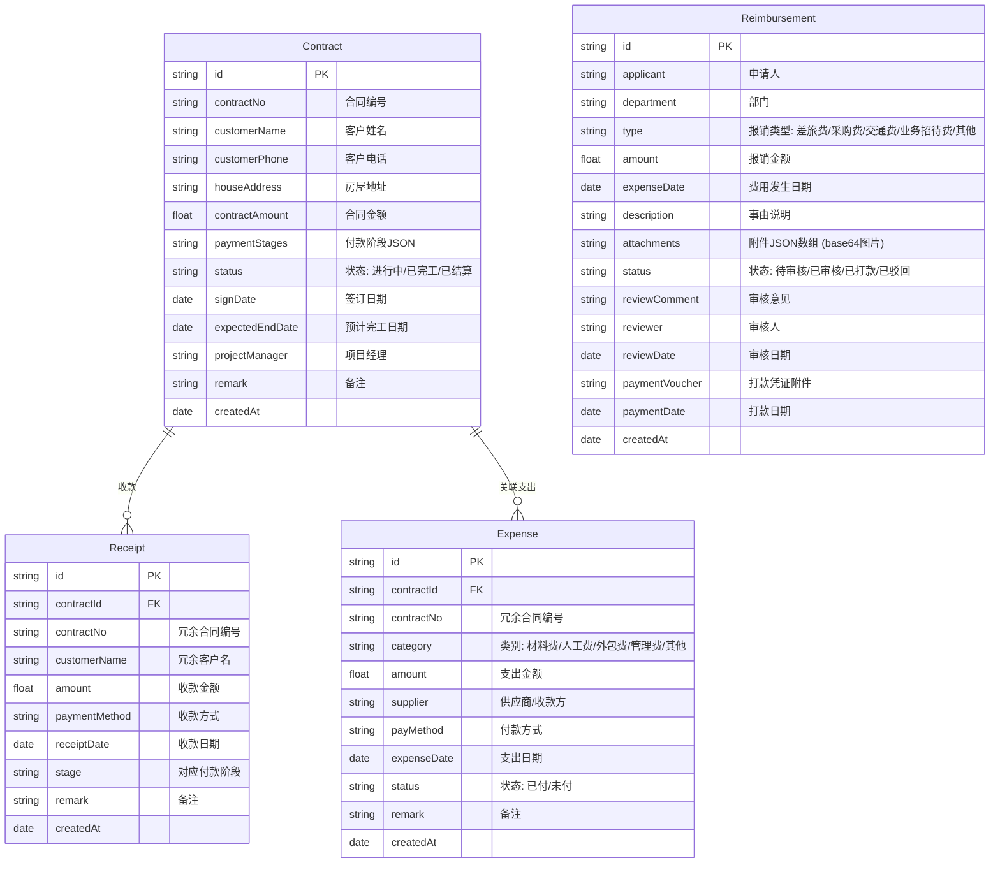

## 1. 架构设计



本系统采用纯前端架构，数据通过 IndexedDB 本地存储，无需后端服务器即可运行。

## 2. 技术选型

| 层级 | 技术 | 说明 |
|------|------|------|
| 前端框架 | React 18 + TypeScript | 类型安全，组件化开发 |
| 构建工具 | Vite 5 | 快速开发构建 |
| 样式方案 | Tailwind CSS 3 | 原子化CSS，快速开发 |
| 路由 | React Router v6 | SPA路由管理 |
| 状态管理 | Zustand | 轻量级状态管理 |
| 图表 | ECharts 5 | 功能丰富的图表库 |
| 图标 | Lucide React | 现代化图标库 |
| 本地数据库 | Dexie.js + IndexedDB | 浏览器端数据库 |
| 日期处理 | dayjs | 轻量日期库 |
| 导出 | xlsx (SheetJS) | Excel导出 |

## 3. 路由定义

| 路由 | 页面 | 说明 |
|------|------|------|
| / | 财务仪表盘 | 默认首页，财务概览 |
| /contracts | 合同管理 | 合同列表及CRUD |
| /contracts/:id | 合同详情 | 单个合同详情 |
| /income | 收入管理 | 收款记录管理 |
| /expense | 支出管理 | 支出记录管理 |
| /receivable | 应收账款 | 应收管理 |
| /payable | 应付账款 | 应付管理 |
| /projects | 项目成本核算 | 项目利润分析 |
| /projects/:id | 项目详情 | 单个项目收支明细 |
| /cashflow | 资金流水 | 流水明细 |
| /reports/profit | 利润表 | 财务报表-利润 |
| /reports/cashflow | 现金流量表 | 财务报表-现金流 |
| /reimbursement | 费用报销 | 报销列表及审核管理 |
| /reimbursement/new | 提交报销 | 新建报销申请 |
| /reimbursement/:id | 报销详情 | 报销单详情及审核操作 |

## 4. 数据模型

### 4.1 ER图



### 4.2 数据定义

```sql
-- 合同表
CREATE TABLE contracts (
    id TEXT PRIMARY KEY,
    contractNo TEXT UNIQUE NOT NULL,
    customerName TEXT NOT NULL,
    customerPhone TEXT,
    houseAddress TEXT,
    contractAmount REAL NOT NULL DEFAULT 0,
    paymentStages TEXT DEFAULT '[]',
    status TEXT DEFAULT '进行中',
    signDate TEXT,
    expectedEndDate TEXT,
    projectManager TEXT,
    remark TEXT,
    createdAt TEXT NOT NULL
);

-- 收款记录表
CREATE TABLE receipts (
    id TEXT PRIMARY KEY,
    contractId TEXT NOT NULL,
    contractNo TEXT,
    customerName TEXT,
    amount REAL NOT NULL DEFAULT 0,
    paymentMethod TEXT DEFAULT '银行转账',
    receiptDate TEXT NOT NULL,
    stage TEXT,
    remark TEXT,
    createdAt TEXT NOT NULL,
    FOREIGN KEY (contractId) REFERENCES contracts(id)
);

-- 支出记录表
CREATE TABLE expenses (
    id TEXT PRIMARY KEY,
    contractId TEXT,
    contractNo TEXT,
    category TEXT NOT NULL DEFAULT '材料费',
    amount REAL NOT NULL DEFAULT 0,
    supplier TEXT,
    payMethod TEXT DEFAULT '银行转账',
    expenseDate TEXT NOT NULL,
    status TEXT DEFAULT '已付',
    remark TEXT,
    createdAt TEXT NOT NULL,
    FOREIGN KEY (contractId) REFERENCES contracts(id)
);

-- 报销申请表
CREATE TABLE reimbursements (
    id TEXT PRIMARY KEY,
    applicant TEXT NOT NULL,
    department TEXT DEFAULT '工程部',
    type TEXT NOT NULL DEFAULT '其他',
    amount REAL NOT NULL DEFAULT 0,
    expenseDate TEXT NOT NULL,
    description TEXT,
    attachments TEXT DEFAULT '[]',
    status TEXT DEFAULT '待审核',
    reviewComment TEXT,
    reviewer TEXT,
    reviewDate TEXT,
    paymentVoucher TEXT,
    paymentDate TEXT,
    createdAt TEXT NOT NULL
);
```

### 4.3 种子数据

系统预置12个月左右的模拟数据，包含：
- 15-20个装修合同（不同状态）
- 每个合同2-5笔收款记录
- 每个合同3-8笔支出记录
- 10-15条报销记录（覆盖待审核/已审核/已打款/已驳回等各状态）
- 涵盖不同项目规模和利润水平

## 5. 项目结构

```
erp-finance/
├── index.html
├── package.json
├── tsconfig.json
├── vite.config.ts
├── tailwind.config.js
├── postcss.config.js
├── src/
│   ├── main.tsx                 # 入口
│   ├── App.tsx                  # 路由配置
│   ├── index.css                # 全局样式
│   ├── db/
│   │   ├── index.ts             # Dexie数据库定义
│   │   └── seed.ts              # 种子数据
│   ├── store/
│   │   └── financeStore.ts      # Zustand全局状态
│   ├── types/
│   │   └── index.ts             # TypeScript类型定义
│   ├── utils/
│   │   ├── format.ts            # 金额/日期格式化
│   │   └── export.ts            # 导出工具
│   ├── components/
│   │   ├── Layout.tsx           # 主布局（侧边栏+内容）
│   │   ├── Sidebar.tsx          # 侧边导航
│   │   ├── StatCard.tsx         # 统计卡片
│   │   ├── DataTable.tsx        # 通用数据表格
│   │   └── Modal.tsx            # 通用弹窗
│   └── pages/
│       ├── Dashboard.tsx        # 财务仪表盘
│       ├── Contracts.tsx        # 合同管理
│       ├── ContractDetail.tsx   # 合同详情
│       ├── Income.tsx           # 收入管理
│       ├── Expense.tsx          # 支出管理
│       ├── Receivable.tsx       # 应收账款
│       ├── Payable.tsx          # 应付账款
│       ├── ProjectCost.tsx      # 项目成本核算
│       ├── ProjectDetail.tsx    # 项目详情
│       ├── CashFlow.tsx         # 资金流水
│       ├── Reports.tsx          # 财务报表
│       └── Reimbursement.tsx     # 费用报销
```